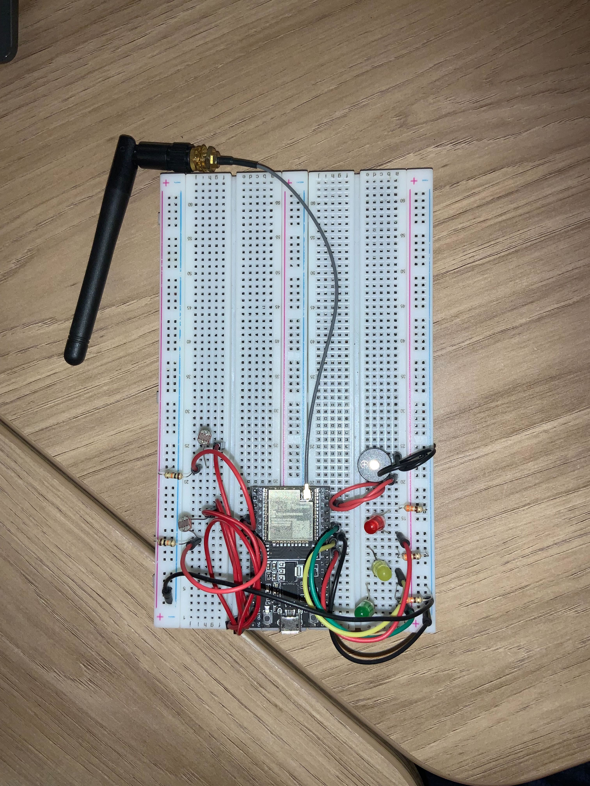

# IoTDoc: Ponderada do Semáforo Online

Sumário

1. [Introdução](#1-introdução)  
2. [Montagem Física](#2-montagem-física)  
3. [Funcionamento do Sistema](#3-funcionamento-do-sistema)  
   - 3.1 [Modo Noturno com LDR](#31-modo-noturno-com-ldr)  
   - 3.2 [Abertura do Semáforo via LDR](#32-abertura-do-semáforo-via-ldr)  
4. [Interface Online](#4-interface-online)  
5. [Conclusão](#5-conclusão)

Sumário Visual (Tabelas)

    Tabela 1 - Sumário Visual (Tabelas)

| *N.º* | *Título*                                                                      |
|---------|---------------------------------------------------------------------------------|
| 1       | [Tabela 1 - Componentes utilizados no projeto](#tabela1)                       |
| 2       | [Tabela 2 - Links para a interface online](#tabela2)                           |
| 3       | [Tabela 1 - Sumário Visual (Tabelas)](#tabela1)                                |

    Fonte: Material produzido pelos autores (2024)

Sumário Visual (Imagens)

    Tabela 2 - Sumário Visual (Imagens)

| *N.º* | *Título*                                                 |
|---------|------------------------------------------------------------|
| 1       | [Figura 1 - Circuito montado em protoboard](#figura1)      |
| 1       | [Figura 2 - Circuito montado em protoboard](#figura2)      |

    Fonte: Material produzido pelos autores (2024)

## 1. Introdução

Esta documentação apresenta o projeto Semáforo Online, desenvolvido como parte da atividade ponderada da semana 5 do módulo 4 do Inteli. O objetivo foi criar um sistema de controle de semáforo que integrasse sensores físicos e uma interface online funcional utilizando a plataforma Ubidots. Esta documentação aborda tanto a montagem física do circuito quanto a interface e as lógicas que garantem seu funcionamento.

## 2. Montagem Física

Tomamos a decisão de realizar a montagem do circuito em protoboards devido a dificuldades técnicas na maquete fornecida, como pouco espaço entre as "ruas" e a protoboard, jumpers desencapados soldados e a falta de disponibilidade de jumpers macho-fêmea e fêmea-fêmea menores, para uma montagem menos confusa na questão de fios embolados. Além disso, os sensores LDR de 5mm utilizados tinham problemas de encaixe com os jumpers disponíveis, o que tornava a ligação instável. O uso das protoboards solucionou esses problemas e permitiu um design mais ajustável e funcional.

Apesar das melhorias proporcionadas pela utilização das protoboards, a falta de jumpers de tamanho adequado ainda resultou em uma certa confusão na organização dos fios. O comprimento excessivo dos jumpers disponíveis gerou sobreposição em algumas áreas, dificultando a visualização clara do circuito.

Para a organização do circuito, os jumpers claros (branco, vermelho, laranja, verde e amarelo) foram utilizados para representar conexões de alimentação de 5V ou 3.3V, enquanto os jumpers escuros (azuis e pretos) foram utilizados para representar GND. Não seguimos o padrão convencional de cores (laranja para 3.3V, vermelho para 5V e preto para GND) devido à falta de disponibilidade de jumpers no laboratório, o que limitou nossa capacidade de padronização.

Abaixo apresentamos as fotos dos dois circuitos montados e o link do vídeo do funcionamento do projeto:

    Figura 1 - Circuito 1 e Circuito 2 montados em protoboard
     
    
    
     
    Fonte: Material produzido pelos autores (2024)

Link do vídeo: <https://drive.google.com/file/d/1lkhqmSv7XgiFWKU5fEFeWiGBKbXsNo8a/view?usp=sharing>

Os componentes utilizados estão listados na tabela abaixo, divididos igualmente entre os dois protótipos desenvolvidos.

    Tabela 1 - Componentes utilizados no projeto

| *Componente*         | *Quantidade* |
|-------------------------|----------------|
| ESP32                  | 2              |
| Protoboard             | 2              |
| Cabo USB               | 2              |
| LED Verde              | 2              |
| LED Amarelo            | 2              |
| LED Vermelho           | 2              |
| Antena Wi-Fi           | 2              |
| LDR                    | 4              |
| Resistor               | 10             |
| Jumper                 | 22             |
| Buzzer                 | 2              |

    Fonte: Material produzido pelos autores (2024)

## 3. Funcionamento dos sensores LDR

O sistema utiliza sensores LDR para duas funções principais: ativar o modo noturno e controlar a abertura do semáforo para veículos. Ambas as funções contam com um processo de calibração inicial, adaptando o comportamento às condições do ambiente.

### 3.1 Modo Noturno com LDR

O sensor LDR mede a luminosidade do ambiente no momento da inicialização para definir um limite dinâmico de 30%. Caso a luminosidade detectada caia abaixo desse limite, o modo noturno é ativado, indicando estado de alerta. Durante o modo noturno, o LED amarelo do semáforo pisca continuamente, enquanto os outros LEDs permanecem apagados. O sistema se mantém nesse estado até que o modo seja desativado manualmente.

### 3.2 Abertura do Semáforo via LDR

Para a detecção de veículos, foi utilizado um segundo sensor LDR. Esse sensor funciona de maneira similar ao do modo noturno, utilizando a calibração inicial para definir o limite de 30%. Quando a luminosidade detectada indica a presença de um veículo, o LED verde do semáforo acende, permitindo a passagem do carro. O semáforo retorna ao estado normal após a saída do veículo.

## 4. Interface Online

A interface online foi criada na plataforma Ubidots, que oferece integração simples com o ESP32, visualização de dados em tempo real e controle remoto. O acesso à interface pode ser realizado por meio de links diretos ou com login em uma conta vinculada ao Inteli.

Os gráficos exibem os valores captados pelos sensores LDR, representados em lux (unidade de medida de intensidade luminosa). Já os botões permitem ativar ou desativar o modo noturno pela Ubidots, independentemente da luminosidade ambiente e abrir o semáforo também independente da luminosidade. A plataforma também envia alertas para os operadores via WhatsApp, informando situações como ativação do modo noturno.

Abaixo apresentamos o link da plataforma e dos graficos individuais.

    Tabela 2 - Links para a interface online

| *Descrição*                                  | *Link*         |
|------------------------------------------------|------------------|
| Plataforma (Ubidots)                           | [Ubidots](https://inteli-ubidots.iot-application.com/app/dashboards/672902db87a2978bf4c09b18) |
| Gráfico do Semáforo A                          | [Gráfico A](https://inteli-ubidots.iot-application.com/app/dashboards/public/widget/HywLLmlnQzbGxvp-cnGk_yAOYqbBZHMSN_PZsBOJ3Bg) |
| Gráfico do Semáforo B                          | [Gráfico B](https://inteli-ubidots.iot-application.com/app/dashboards/public/widget/_Du_8-vGztPSb1HZy0stllfTIlUNG0WWCyVYc-Wu6v8) |

    Fonte: Material produzido pelos autores (2024)

Em conclusão, acreditamos que a solução apresentada atende plenamente à proposta da atividade ponderada, demonstrando sua viabilidade como uma aplicação prática de IoT em um cenário real, ainda que em uma escala reduzida.
